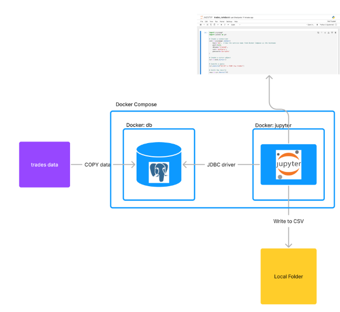
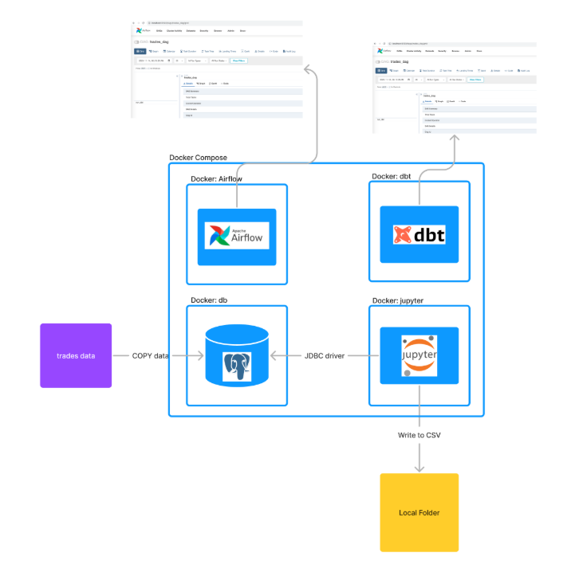
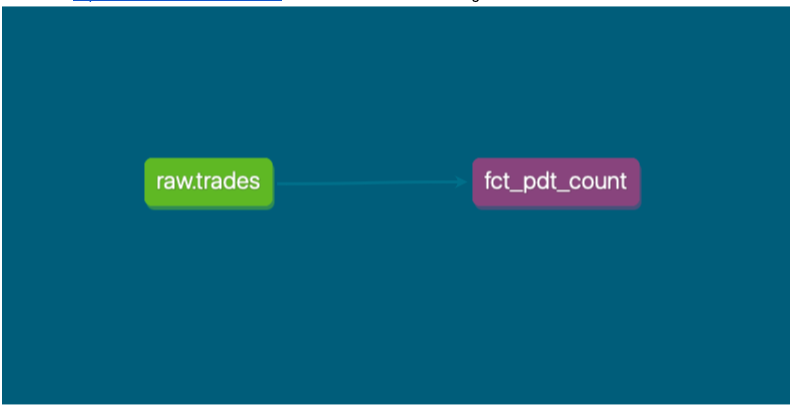
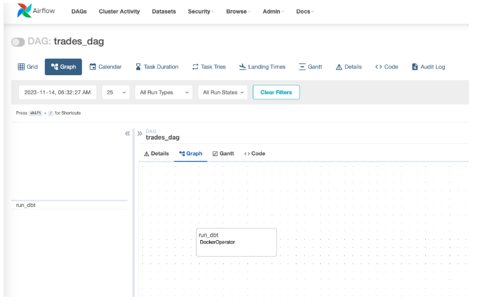
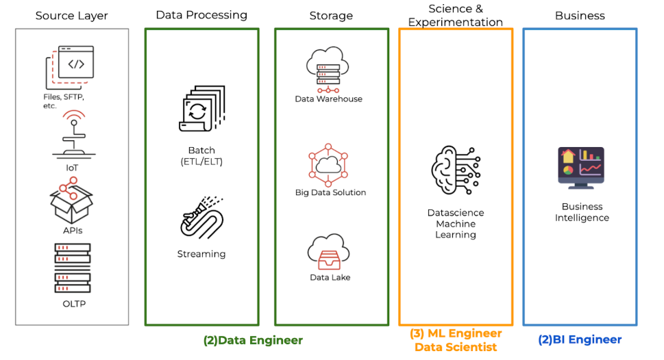

# Date Trades Analytics Solution

## Summary


## How to start

[Sumamry about the project](https://docs.google.com/document/d/1PNHW8KjP0V_PIcy_UxWZDRM6w2AMLxKg1co-UmPbOyg/edit#heading=h.vvmlfmwbv2yp)

You can run the solution using `docker-compose up`. Before you will be run compose, we should upload data into the `02_data_platform/db/trades.csv` file in the format:

```
account_id,symbol,side,qty,timestamp
111111,GOOG,sell,10,2021-09-04 09:30:00
```
Then we can run the commands:

```
cd 02_data_platform/
docker-compose build --no-cache
docker-compose up
```

## What is Date Trades 
According to [documentation](https://docs.alpaca.markets/docs/user-protection)

A day trade is defined as a round-trip pair of trades within the same day (including extended hours). This is best described as an initial or opening transaction that is subsequently closed later in the same calendar day. For long positions, this would consist of a buy and then sell. For short positions, selling a security short and buying it back to cover the short position on the same day would also be considered a day trade.

Day trades are counted regardless of share quantity or frequency throughout the day.

# Solution 

The solution has **3 options**:

1. **Self-Service analysis with Jupyter Notebook**  
2. **Traditional data engineering solution**: DBT model with Airflow  
3. **Production-ready solution** (documented concept only, not implemented)

## How to Start the Project

### Project Structure:

```plaintext
├── airflow
│   ├── dags
│   │   └── trades_dag.py
│   ├── dockerfile
│   └── entrypoint.sh
├── db
│   ├── data
│   ├── docker-entrypoint-initdb.d
│   │   └── init.sql
│   ├── dockerfile
│   └── readme.md
├── dbt
│   ├── dbt_trades
│   │   ├── dbt_project.yml
│   │   ├── models
│   │   │   └── trades
│   │   │       ├── fct_pdt_count.sql
│   │   │       └── fct_pdt_count.yml
│   │   └── sources
│   │       └── sources.yml
│   ├── dockerfile
│   ├── profiles.yml
│   ├── readme.md
│   └── run_dbt_docs.sh
├── docker-compose.yml
├── jupyter
│   ├── dockerfile
│   ├── output
│   │   └── trades_notebook.ipynb
│   └── readme.md
└── readme.md
```

## Containers Overview

There are **4 Docker containers**:

1. **airflow**: Standalone Airflow server with a single DAG for the DBT model.  
2. **db**:  
   - Postgres database container.  
   - Upload the `trades.csv` file before running Docker Compose.  
   - The `init.sql` file creates a table and uploads data from the CSV file.

3. **dbt**: Contains the DBT project that connects to the Postgres database.  
   - **Model**: `fct_pdt_count` returns a view with account and the number of day trades.

4. **jupyter**: Jupyter Notebook container.  
   - **Output folder**: Contains the notebook and its results.

---

## How to Run the Project

Run the following commands:

```bash
cd 02_data_platform
docker compose build
docker compose up
```

```plaintext
CONTAINER ID   IMAGE                      COMMAND                  STATUS                    PORTS                    NAMES
f9015c251f45   02_data_platform_airflow   "./entrypoint.sh air..." Up 21 seconds             0.0.0.0:8090->8080/tcp   02_data_platform-airflow-1
455f20c485a2   02_data_platform_jupyter   "tini -g -- start-no..." Up 21 seconds (healthy)   0.0.0.0:8888->8888/tcp   02_data_platform-jupyter-1
ce7aa3f1b776   02_data_platform_dbt       "/app/run_dbt_docs.sh"   Up 21 seconds             0.0.0.0:8080->8080/tcp   02_data_platform-dbt-1
214cb7c1a190   02_data_platform_db        "docker-entrypoint.s..." Up 22 seconds             0.0.0.0:5433->5432/tcp   02_data_platform-db-1
```

---

### Connecting to Services

1. **Postgres Database**:  
   - **Host**: `localhost`  
   - **Port**: `5433`  
   - **User**: `postgres`  
   - **Password**: `postgres`  

2. **Jupyter Notebook**:  
   - URL: [http://localhost:8888/](http://localhost:8888/)  
   - Notebook: `02_data_platform/jupyter/output/trades_notebook.ipynb`

3. **Airflow (Orchestration)**:  
   - URL: [http://localhost:8090/login/](http://localhost:8090/login/)  
   - **User**: `admin`  
   - **Password**: `admin`  

4. **DBT Docs**:  
   - URL: [http://localhost:8080/#!/overview](http://localhost:8080/#!/overview)  

## Self-Service Analysis with Jupyter Notebook

### Architecture


If `docker compose` runs successfully, open the Jupyter Notebook at:  
`http://localhost:8888/notebooks/work/trades_notebook.ipynb`.  

The notebook saves output to:  
```plaintext
02_data_platform/jupyter/output/pdt_count.csv
```

Validation for account 27978

I’ve manually checked the day traidings for account 27978 and got the same result - 12 day trades. Raw data for this account:

```plaintext
account_id|symbol|side|qty|timestamp          |
----------|------|----|---|-------------------|
     27978|AAPL  |buy |645|2023-09-04 09:58:04|
     27978|AAPL  |sell|645|2023-09-07 10:40:35|
     27978|AAPL  |buy |148|2023-09-08 12:55:29|
     27978|AAPL  |sell|148|2023-09-08 15:53:21|1
     27978|ADBE  |buy |266|2023-09-04 10:19:40|
     27978|ADBE  |sell|266|2023-09-05 13:57:39|
     27978|ADBE  |buy |436|2023-09-08 14:17:53|
     27978|AMZN  |buy |700|2023-09-07 14:04:33|
     27978|AMZN  |sell|700|2023-09-07 14:40:00|1
     27978|FB    |buy |866|2023-09-04 15:10:26|
     27978|FB    |buy |376|2023-09-04 15:52:17|
     27978|FB    |sell|680|2023-09-04 15:53:54|1
     27978|FB    |sell|866|2023-09-04 15:56:57|
     27978|FB    |buy |605|2023-09-05 10:45:57|
     27978|FB    |sell|376|2023-09-05 12:06:00|1
     27978|FB    |buy |680|2023-09-05 13:40:20|
     27978|FB    |sell|605|2023-09-08 09:38:22|
     27978|GOOG  |sell|101|2023-09-04 10:08:40|
     27978|GOOG  |buy |101|2023-09-04 15:06:38|1
     27978|GOOG  |sell|749|2023-09-05 15:35:25|
     27978|GOOG  |buy |749|2023-09-08 11:57:22|
     27978|MSFT  |sell| 17|2023-09-04 15:09:27|
     27978|MSFT  |sell|216|2023-09-04 15:35:24|
     27978|MSFT  |buy |309|2023-09-05 10:13:47|
     27978|MSFT  |buy |923|2023-09-05 12:43:30|
     27978|MSFT  |sell|440|2023-09-06 11:05:03|
     27978|MSFT  |buy | 58|2023-09-06 11:42:19|1
     27978|MSFT  |buy |216|2023-09-06 15:45:05|
     27978|MSFT  |buy |440|2023-09-07 11:08:42|
     27978|MSFT  |sell| 58|2023-09-07 11:30:17|1
     27978|MSFT  |sell|309|2023-09-08 13:45:35|
     27978|MSFT  |sell|923|2023-09-08 14:02:32|
     27978|NFLX  |sell|390|2023-09-04 09:36:41|
     27978|NFLX  |sell|428|2023-09-04 14:18:05|
     27978|NFLX  |buy |390|2023-09-05 11:14:37|
     27978|NFLX  |buy | 16|2023-09-05 15:26:32|
     27978|NFLX  |buy |428|2023-09-06 11:03:31|
     27978|NFLX  |sell| 16|2023-09-07 09:31:59|
     27978|NVDA  |sell|638|2023-09-04 12:49:23|
     27978|NVDA  |sell|267|2023-09-04 13:04:47|
     27978|NVDA  |sell|202|2023-09-04 13:34:59|
     27978|NVDA  |sell| 50|2023-09-04 14:13:49|
     27978|NVDA  |buy |638|2023-09-05 12:11:53|
     27978|NVDA  |sell|318|2023-09-05 12:12:25|1
     27978|NVDA  |buy |202|2023-09-05 12:16:04|
     27978|NVDA  |buy | 50|2023-09-06 12:40:03|
     27978|NVDA  |buy |318|2023-09-06 13:04:18|
     27978|PYPL  |buy |250|2023-09-04 09:42:56|
     27978|PYPL  |sell|876|2023-09-04 13:39:06|1
     27978|PYPL  |sell|752|2023-09-05 10:23:57|
     27978|PYPL  |buy |876|2023-09-05 15:07:38|1
     27978|PYPL  |buy |752|2023-09-05 15:40:39|
     27978|PYPL  |sell|297|2023-09-06 13:20:57|
     27978|TSLA  |sell|656|2023-09-04 12:46:04|
     27978|TSLA  |buy |279|2023-09-05 10:38:55|
     27978|TSLA  |sell|279|2023-09-05 11:10:14|1
     27978|TSLA  |sell|108|2023-09-05 11:34:50|
     27978|TSLA  |buy |690|2023-09-06 10:54:40|
     27978|TSLA  |buy |108|2023-09-06 13:36:59|
     27978|TSLA  |sell|690|2023-09-07 09:42:56|
     27978|TSLA  |buy |555|2023-09-08 12:26:29|
     27978|TSLA  |sell|555|2023-09-08 13:56:58|1
```

The next section will talk about DBT and Airflow.

There was one case for account 85456 where has BUY and SELL at the same time “2023-09-06 10:29:22”. I assume ideally we would need to have the more granular seconds.

## Traditional Data Engineering Solution (DBT + Airflow)

### Architecture


In this solution, I used **DBT** and **Airflow** for a modern data engineering pipeline. The project connects all containers, simulating a **development environment**.

- Replace Postgres with production databases like **BigQuery** or **Snowflake**.  
- Use **development profiles** in DBT.  

**Access Links**:
- **DBT Docs**: [http://localhost:8080/#!/overview](http://localhost:8080/#!/overview)  



- **Airflow**: [http://localhost:8090/login/](http://localhost:8090/login/)  



For production-ready Airflow, consider **Astro** for managed Airflow: [https://www.astronomer.io/](https://www.astronomer.io/).

## Production-Ready Solution

### High-Level Architecture


### Architecture Layers:

1. **Source Layer**: Backend, business apps, CRM systems, Social Media, etc.  
2. **Storage Layer**: Centralized storage in **Google BigQuery**.  
3. **Data Processing Layer**: Tools for data ingestion and transformation:  
   - **Extract**: Meltano, Fivetran, Airbyte  
   - **Transform**: Spark, DBT, Matillion ETL  

4. **Business Layer**: BI tools like **Looker**, **Tableau**, or **Power BI**.  
5. **Science & Experimentation Layer**: Advanced analytics and ML.

---

### Best Practices

1. **DevOps**:  
   - Infrastructure as Code (e.g., Terraform)  
   - Version control (Git)  
   - CI/CD for deployment  

2. **Data Observation**:  
   - Proactive monitoring with tools like **Monte Carlo**, **DataDog**, etc.  

3. **Data Quality**:  
   - Frameworks like **DBT tests**, **Great Expectations**, or **Soda**.

---

This concludes the documentation of the **3 solutions**:  
1. **Self-Service Analysis with Jupyter Notebook**  
2. **Traditional Data Engineering Solution (DBT + Airflow)**  
3. **Production-Ready Architecture**