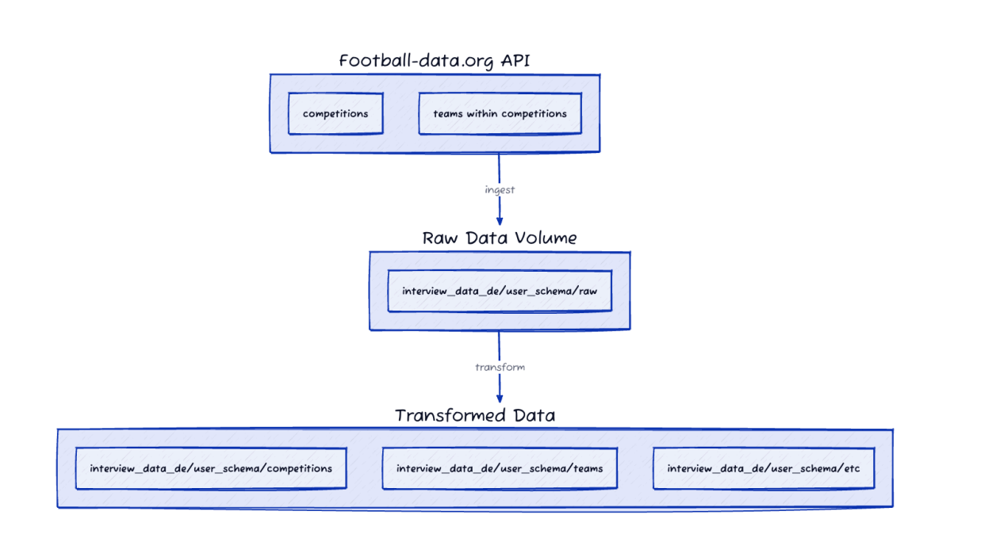

# Data Engineering Skills Test

Congratulations on advancing to this stage! We now want to get a feel for how you use code to solve problems and handle data.

## Why We Do This

This exercise is designed to help us assess your **technical, analytical, and communication skills** across key areas, including:

- Coding
- System design
- Analysis
- Documentation

## What We’re Looking For

We’ll review your submission based on several criteria to understand your approach and problem-solving style. Here’s what we’ll evaluate:

### Technical Execution

- **Code Quality**:  
  Many data pipeline tasks require coding, which will be a key part of your role.  
  We value **code that is clear and maintainable**, prioritizing readability over performance.  
  We believe in:  
  > *“Make it work, then make it fast.”*

- **Approach and Justification**:  
  There’s no single *"right"* way to complete these tasks.  
  We’re interested in:  
  - The decisions you make  
  - How you justify them  
  - Your development approach

- **Execution**:  
  Ensure your code:  
  - Runs successfully  
  - Includes all instructions for execution

- **Production Readiness**:  
  While this is a test, we’d like to see how you think about **production deployment**.  
  Describe the **additional steps** you’d take to prepare the solution for a production environment.

### Analytical and Communication Skills

- **Requirement Analysis**:  
  We’ll assess:  
  - How well you understood the requirements  
  - The steps you took to meet them

- **Simplicity**:  
  Is your solution **straightforward** and as simple as possible without sacrificing quality?

- **Communication**:  
  Since we work remotely, strong **written communication** is essential.  
  We’ll evaluate:  
 
# Guidelines

## Time Management

- Please limit the exercise to **3 hours**.  
- You have **one week** from the date we sent the exercise to submit your response.

## Environment

Use the provided **Databricks workspace** for your code and documentation.

### Workspace:

- **Workspace URL**: `interviewing workspace`  
- Sign in using the email address associated with your application.  
  - You will receive a **2FA code** at login.

### Code:

- Work within your **user workspace**:  
  - Navigate to: `Workspace > Home`
- Use **SQL** and **Python** or **Scala** for your solution.

### Storage:

- Use the catalog and schema provisioned for you:  
  - `Catalog > interview_data_de > {your schema}`

### Compute:

- Use the **serverless notebook** and **serverless SQL warehouse compute**.

## Reproducibility

Include **all necessary instructions** to run your solution.

## AI and LLMs

We encourage the use of **AI tools** and **Large Language Models (LLMs)** as part of your solution.  

- Clearly document where and how they were used:  
  - Examples: *code generation, analysis, or optimization.*

## Support

If you have any questions or need assistance, feel free to **reach out via email**.

## Submission

- Ensure you have covered all parts of the task requirements, including:  
  - Completed **code**  
  - Thorough **documentation**  

Once you are ready, please **email us** to let us know you're happy for us to review your submission.

# Tasks

## Overview

This test simulates a **data pipeline** scenario where you will:

1. Retrieve data from **public APIs**.  
2. **Process** and **transform** the data.  
3. Store it in a **structured format**.  
4. Optionally perform additional **analyses**.

You will use **Databricks** for pipeline development.  
We will review **code quality, accuracy, AI integration**, and **documentation**.

## Part A: Data Ingestion and Initial Storage

**Goal**: Ingest data from the following API endpoints, handle rate limiting, and store **raw data files**.

### Football API:

- **Signup**: Create a free account [here](https://www.football-data.org/).  
- **API Key**: Retrieve the API key (emailed to you).  
- **API Documentation**: [Quickstart Guide](https://www.football-data.org/documentation/quickstart)

### Instructions:

1. **Retrieve data** from the following API endpoints:
   - `Teams`  
   - `Competitions`  
   - `Teams within the competitions` (iterate over all competitions)

2. **Handle rate limits**:  
   - Manage API throttling effectively.  
   - Ensure the pipeline handles **failure scenarios** such as missing data or API outages.

3. **Store raw data files**:  
   - Save the data in **DELTA**, **JSON**, or **CSV** format.  
   - Path: `interview_data_de/{user_schema}/raw`

## Part B: Transformation and Data Storage

**Goal**: Transform raw data into a **structured, tabular format** within the provided schema.

### Steps:

1. Use **Spark** or **Databricks SQL** to create organized tables in your schema:  
   - **Entities**:  
     Tables to capture **core entities** such as `teams` and `competitions`.  
     Include key attributes (e.g., `id`, `name`).  
   - **Event or Time Series Data**:  
     Tables to store event details (e.g., competitions or transactions).  
   - **Aggregates**:  
     Tables that calculate measures like **counts** or **averages** for analytical insights.

2. **Apply necessary transformations**:  
   - Clean and deduplicate data.  
   - Parse nested fields.  
   - Ensure data **quality** and **consistency**.

3. **Data Quality Checks**:  
   - Add checks or alerts to monitor data **quality**, **completeness**, and **integrity**.

4. Document **schema assumptions** and **design choices** in the README file.

## Part C: Documentation

**Goal**: Document and package your solution for review.

### Documentation Requirements:

1. **README**:  
   - Setup instructions.  
   - How to run the code.  
   - Assumptions made.

2. **Data Flow Diagram**:  
   - Add a simple diagram (hand-drawn is acceptable) showing data flow from **ingestion** to **reporting**.

3. **AI Evidence**:  
   - Document how **AI tools** were used or applied (e.g., code generation, analysis, or optimization).

