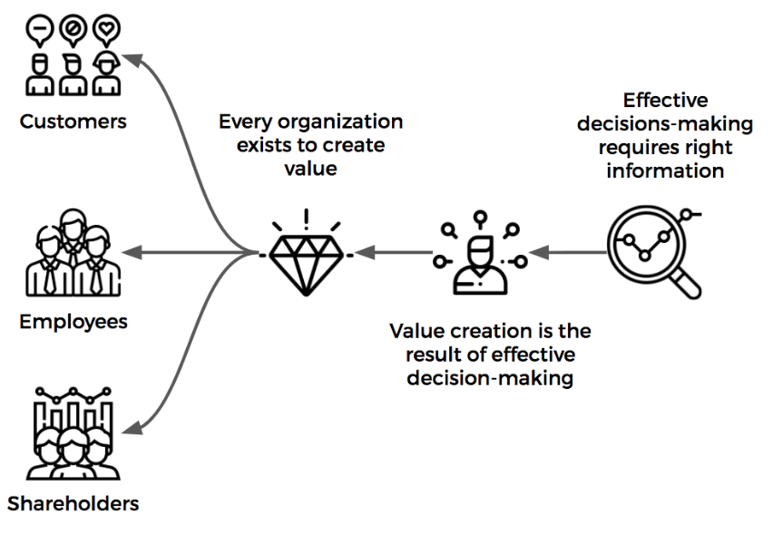

# Software Version Analytics

*You are building a data model for tracking versions of software installed by a given user, which you will derive from hourly batches of user event data stored in text files.*

*Conceive and design a database table to hold this information.
The table should contain a single row per user and allow support queries to determine which software 
version was in effect at any given point in time.*

- *How will you store historical values?*
- *What limitations in the database technology could make this challenging?*
- *How should a consumer access the data?*

*Logically describe how you would process this information in code, pseudo-code or a flowchart*

# Assumptions

Users get software and it has telemetry client. During the use of software, it generates logs and client send them to the Online Service that can do minimum operations and then write telemetry files to the storage. I assume it is **AWS S3**. The files writing into the following structure: `s3://telemetry/service-logs/YYYY/MM/DD/HH/files.tsv`

The structure of folders looks like:

```bash
- bucket_name
	|- service-folder
		|- 2020
		|- 2021
		|- 2022
			|-01
			|-02
			|-03
				|-01
				|-02
				|-03
					|-01
					|-02
					|-03
		
```

For example, all telemetry events for a single hour will be in this `s3://telemetry/service-logs/2022/05/27/05/*.tsv`

> The size, structure and type of the files can be different, depends on requirements and workload. Usually I use `JSON` for telemetry to pass nested objects.
> 

My next assumption, that company doesn’t have a solid data platform and I have a flexibility to choose the best platform.

The data volume is tricky one. The hourly partition can have any number of events per hour and depends on volume per hour it may require different cluster size.

# Business Requirements

Business stakeholders (designers, artists, QA and gameplay engineers) would like to track the the version of software among users. Product should provide the flawless experience for end users. Running on old versions might drop user experience. Moreover, this data is helpful for Campaign Management, Churn and Retention. No doubt, we want to have this data and provided the self-service tools for business users to discover insights and slice and dice data.

In other words, the product itself exists to generate value. I would use my favorite diagram of value driven organizations:



Idea is simple. Typical organization is exists to generate value. There are different groups of people, in our case: Players (Users), Engineers, Leadership team and so on.  In order to grow, org should generate more value. Value creation is the result of effective decision making, this is the show time for Data Engineering and Data Analytics teams to help collect data and help to make decisions.

## Software Version Questions

There are common questions to answer:

- What is current list of active versions?
- Can we shutdown the old versions? What is the impact?
- What is distribution of users among different versions and devices?
- Did users get notification about the Version Upgrade? What is the status of Notification?
- What is use of new features?
- Any A/B active tests among versions?
- What is the source of product installation?
- Number of issues per version?
- Correlation with engagement, retention and churn per version?
- What is the list of features/bugs the product team should focus on new version?
- What is the cadence of releases? Should be more often or less often?
- Correlation of version number and session length or any other player behavior metrics.

PS my source of gamins insights is this book:


# Architecture proposal

First of all, there are multiple approaches available. Conceptually, it is traditional approach when we extract data and load it into storage layer and then serve it. Conceptually the solution is looks like this:


There are multiple layers:

- Source Layer - places where data is generated
- Data Processing - data pipelines for Extract and Transform data
- Storage - place to store data - Data Warehouse, Data Lake or Lake House
- Science & Experimentation - place for ML engineers and data scientists
- Business - usually BI tool like Tableau, Power BI or SQL and Excel

As a Data Engineer, I have to answer multiple questions:

1. Where to store data? (Data Warehouse vs Data Lake and what tools to use)
2. How to build data pipelines (Stream vs Batch and what tools to use)

Usually the company made this decision and you have to work with what they have. Often, you can initiate the migration process (modernization & innovation). At least, you can be sure with the Cloud provider, it might be one of AWS, Azure or GCP. 

## Storage Solution Choice

There aren’t many options available on the market. I’ve created a mindmap:


*By `Amazon Athena` I mean that we can use it as Data Platform SQL Engine and store data in S3 including Iceberg format. (not scalable solution)

I split this into 2 buckets: Data Warehouse vs Data Lake. The data lake also includes Lake house solutions.

My personal choice is Snowflake for data warehouse as the most comfortable and robust. Moreover, I wrote a book about it [**Jumpstart Snowflake: A Step-by-Step Guide to Modern Cloud Analytics**](https://www.amazon.ca/Jumpstart-Snowflake-Step-Step-Analytics/dp/1484253272/ref=sr_1_4?qid=1653771588&refinements=p_27%3ADmitry+Anoshin&s=books&sr=1-4)

Or Databricks for Lakehouse. There are 2 opposite solutions that allows us move fast and deliver value. They both have great community and pretty mature. 

Snowflake is more user friendly with SQL knowledge. Databricks allows us to leverage PySpark and Scala as well as easy integrates with streaming and ML solutions.

Among these 2 **I choose AWS Databricks**, moreover, I use it for last 1,5 years and enjoying it. 

> There are could be more discussions about use of tool and storage formats.
> 

## Data Integration Solution Choice

We can split into to main buckets:

- Streaming/Batch
- Open Source/Commercial

I’ve create a mindmap:


Since, I’ve chosen Databricks, for Data Integration I will keep the Databricks Notebooks and will schedule within Databricks jobs or Delta tables. 

# Databricks Architecture

We chose solution Databricks on top of AWS cloud, and now we can create the architecture diagram. Moreover, I am planning to use Delta Lake. 

We project could be split into multiple phases, starting from Batch and later adding Streaming Solution with Kinesis.


The delta lake approach allows us to use S3 as a storage and store data within transactional log in Parquet format. Databricks provides managed spark and within runtime it outsource many operations for Spark optimization allows to use scalability, elasticity and many other cloud computing benefits.

Metadata is storing in external Hive Metastore, data in S3. It **avoids vendor lock** vs Snowflake solution.

In data warehouse terms:

- Bronze = raw data (Append operation)
- Silver = staging with clean data (Append operation)
- Gold = fact and dimension tables where we apply analytics functions

In other words, this approach allows us to design data pipelines a kind of Funnel, where we have all data included in raw and then narrow down to specific events. This is example, from [Gaming Conference where I was presenting](https://docs.google.com/presentation/d/1kUR-6o49C2tWf4IU5zUfg8FYeAAJXxT0pfbHyyFWDkY/edit?usp=sharing):


# PySpark Implementation

The scope it to collect data from S3 and calculate the fact tables. I won’t provide super detail approach, but will give an idea and code snippets for the approach I will take in this case.

## String Example

> 1 line of telemetry represents the single event (alternative option is to have bigger files and group events together. For example, we can add all attributes to the single log event. In my example, I have smaller touchpoints and I can order them by Event Timestamp, Session Id and Transaction Id in order to see full story.

My another assumption, that we are getting telemetry from the product and it includes much more data than just version. This solution will server broader use cases and audiences.
> 

We will start from simple assumption of file format. File schema:

- *Category* - telemetry category
- *Timestamp* - event timestamp UTC
- *ServiceName*- id of service or product
- *SessionId* - session id (could be player session)
- *TransactionId* - order of events within session
- *BodyMessage* - nested log with event name and attributes

Example:

```bash
Telemtery 2021-12-24T11:31:19.459+0000 ClientApp 28E93968461E0CF4CBB8429D25B213A0 \
20 { 'Name': 'SoftwareVersion', 'Version': 1.22.03, 'Device': 'Gameboy'}   
```

## Notebooks Structure

Inside Databricks Repo I will organize notebooks in the following order:

```bash
|--__includes #common functions and libraries that are used across all projects
	|--libs.py
	|--utils.py

|--software_version_project #project specific folder
	|--__includes #common functions and libraries for this project
		|--telemetry_schema.json #schema of BodyMessage to parse it within Databricsk
		|--utis.py 
	
	|--raw
		|--__includes
			|--i_raw_ingest.py #logic for the execution notebook
		|--raw_ingest.py #execution notebook

	|--stg
		|--__includes
			|--i_stg_software_version.py #logic for the execution notebook
		|--stg_software_version.py #execution notebook

	|--dw
		|--__includes
			|--i_fact_version.py #logic for the execution notebook
			|--i_dim_version.py
			|--i_dim_device
			|--i_dim_player
		|--fact_version.py #execution notebook
		|--dim_version.py
		|--dim_device.py
		|--dim_player.py
	
```

The current Repo structure demonstrates how I would decouple the logic. The open question is for Gold Layer i.e. `dw` do I want to leverage Dimensional Modelling and split the data for `fact` and `dimension tables`. Currently, I will add only couple dimensions tables that could be serve as dictionary of `devices`, `players` and `versions`. The diagram is below:


## Ingest into Bronze Layer

Let’s start form the 1st layer - data ingestion. According to my schema I will have 2 notebooks - with logic and execution one.

### Logic Notebook | i_raw_ingest.py

The goal is to collect and store raw events as is in bronze table. 

```python
#call utils and 
%run /_includes/utils

#define the shema for insert
schema_raw_source = StructType([StructField("Category",StringType(), False),
                                StructField("TimeStamp",TimestampType(),False),
                                StructField("ServiceName",StringType(), False),
                                StructField("SessionId",StringType(), False),
                                StructField("TransactionId",StringType(), False),
                                StructField("BodyMessage",IntegerType(), False)])

#define source pathin for S3
def get_title_source_url(s3sourcebucket: str) -> str:
		return f"""<s3 source path>"""

#define target path
def get_title_storage_url (s3targetbucket: str) -> str:
    return f"""<s3 target path>"""

#create table if not Exists
def create_raw_ingest_table(s3targetbucket: str):
    title_storage_url = get_title_storage_url(s3targetbucket)
    
    spark.sql(f"""CREATE TABLE IF NOT EXISTS servicedb.raw_cooked
    ( 
        category STRING COMMENT "Telemetry category. Default is Telemetry.",
        body_message STRING COMMENT "Raw event JSON string.",
        title_session_id STRING COMMENT "Game session Id.",
        title_transaction_id STRING COMMENT "Game title transaction Id.",
        service_name STRING COMMENT "Service Name.",
        event_name STRING COMMENT "Event name.",
        event_timestamp_utc TIMESTAMP COMMENT "Event timestamp in UTC.",
        file_name STRING COMMENT "File path from source S3 account."
    )
    USING delta
    LOCATION '{title_storage_url}/raw/raw_ingest'
    PARTITIONED BY (p_ingest_date_utc DATE, p_ingest_hour_utc INT)""")

#define fucntion for ingestion
def read_raw_data(servicename: str, date: str, hour: int, s3bucket: str) -> DataFrame:
    title_source_url = get_title_source_url(s3bucket)
    
    #check that data exists
    try:
        date_path = date.replace('-','/')
        source_path = f"""{title_source_url}/{date_path}/{hour}/"""
        dbutils.fs.ls(source_path)
    except:
        print("No data for " + source_path)
        raw_df = None
    else:
        raw_df = (
            spark
            .read
            .format("text")
            .load(source_path, schema = schema_raw_source)
        )

    return raw_df

#transform dataframe
def transform_raw_data (df: DataFrame) -> DataFrame: 
    #Adding file name and partitions columns before write operations
    raw_df = (
        df
        .withColumn("file_name", F.input_file_name())
        .withColumn("nested_json", F.from_json("BodyMessage", "Name String"))
        .withColumn("event_name", F.col("nested_json.Name"))
    )

    #Generate ingest date column for partitions using file path from azure storage    
    raw_df = (
        raw_df
        .withColumn('p_year', F.split("file_name", '/').getItem(3))
        .withColumn('p_month', F.split("file_name", '/').getItem(4))            
        .withColumn('p_day', F.split("file_name", '/').getItem(5))
        .withColumn('p_ingest_hour_utc', F.split("file_name", '/').getItem(6))
        .withColumn('p_ingest_date_utc', F.concat(F.col('p_year'),F.lit('-'),
										 F.col('p_month'),F.lit('-'), F.col('p_day')))
    )
                      
    #Align all columns, cast and rename to snake case
    raw_df = (
        raw_df
        .select(
            F.col("Category").alias("category")
            ,F.col("BodyMessage").alias("body_message")
            ,F.col("SessionId").alias("title_session_id")
            ,F.col("title_transaction_id")
            ,F.col("ServiceName").alias("service_name")  
            ,F.col("event_name")
            ,F.col("TimeStamp").cast("timestamp").alias("event_timestamp_utc")  
            ,F.col("file_name")
            ,F.col("p_ingest_date_utc").cast("date").alias("p_ingest_date_utc") 
            ,F.col("p_ingest_hour_utc").cast("int").alias("p_ingest_hour_utc") 
        )
    )

    return raw_df
```

### Execution Notebook | raw_ingest.py

> A singe run of job will process a single hour of data. The table is partitioned by `date` and `hour`.  The ETL process is **idempotent**. Each run will use `replaceWhere` operation in Bronze and Gold layers.
> 

```python
#execute notebook with logic
%run ./_includes/i_raw_ingest

##Geting arguments in Databricks Notebook
# Expecting 8 character date number. example : 2021-01-01
dbutils.widgets.text("confDate", "")
param_date = dbutils.widgets.get("confDate")

# Expecting 2 character hour  number. example : 01
dbutils.widgets.text("confHour", "")
param_hour = dbutils.widgets.get("confHour")

#execute logic notebook
%run ./_includes/i_raw_cooked

#create table if not exist
create_raw_cooked_table(s3targetbucket)

write_params = {
    "filter_type": "hour_slice",
    "conf_date": param_date,
    "conf_hour": param_hour,
    "database_name": f"""{param_title}db""",
    "table_name": "raw_ingest",
    "mode": "overwrite"
}

df_raw = read_raw_cooked_data(param_title, param_date, param_hour, param_container)

#If there's no files we generate a dummy row to insert so we know processing of ran.
if df_raw is None:
    df_transform = generate_dummy_row(param_title, param_date, param_hour)
else:
    df_transform = transform_raw_cooked_data(df_raw)

insert_into_delta_table(df_transform, **write_params)

spark.sql(f"""OPTIMIZE {param_title}db.raw_cooked
    WHERE p_ingest_date_utc = '{param_date}'
        AND p_ingest_hour_utc = {param_hour}
    ZORDER BY (event_name)""")
```

> The functions  `generate_dummy_row` and `insert_into_delta_table` are exists in `[utils.py](http://utils.py)` These functions are common for all. The insert function is designed to insert into delta table using `spark.write` with multiple scenarios depends on parameters input.
> 

## Ingest into Silver Layer

The next step it to execute notebooks in silver layer. The main idea is to filter raw table on specific `event_name` . I assume there are multiple events exist that are required for our analysis.

### Logic Notebook | i_stg_version

```python
#get the telemetry Body schema
from notebooks.software_version_project._includes.telemetry_schema import *

#run utils notebooks
%run ./_includes/utils

#create table
def create_stg_version_table(s3targetbucket: str):    
    spark.sql(f"""CREATE TABLE IF NOT EXISTS servicedb.stg_version
				...""")

#transform raw data frame
def transform_stg_version_data(df: DataFrame) -> DataFrame:
		df_raw = (
        #Select columns
        df.select( )
        #Filter events
				.filter(F.col("event_name").isin(
                    "SoftwareVersion"
                    ,"DeviceInfo"
                    ,"Notification")) #all events that are important for analysis
        #Create additional columns 
        .withColumn( )

#optionally we can aggregate data
def aggregate_stg_version(df: DataFrame) -> DataFrame:
		df_agg_transform = (
        df_select()
        .groupBy()
		
	return df_agg_transform 

```

### Execution Notebook | stg_version.py

```python
#execute notebook with logic
%run ./_includes/i_stg_bootcamp

#Set the processing window type, hour, day, range, or all
dbutils.widgets.dropdown("windowType", "hour_slice", ["hour_slice", "date_slice",
 "date_range", "all"])
param_window_type = dbutils.widgets.get("windowType")

#Expecting 10 character date. example : 2021-01-01
dbutils.widgets.text("confDate", "")
param_date = dbutils.widgets.get("confDate")

#Create a table if not exists
create_stg_version_table()

params = {
    "filter_type": param_window_type,
    "conf_date": param_date,
    "conf_hour": param_hour,
    "start_date": param_date,
    "end_date": param_end_date
}

df_raw = read_table(
    **params,
    database_name = "servicedb"
    table_name = "raw_ingest"
)

df_transform = transform_stg_version_data(df_raw)
#df_transform.display()

df_aggregate = aggregate_stg_version(df_transform)

insert_into_delta_table(
    **params,
    df = df_aggregate,
    database_name = DATABASE_NAME,
    table_name = "stg_bootcamp"
)
```

> The execution notebook is using two functions - `insert_into_delta_table` and `read_table` that are defined it `[utils.py](http://utils.py)` . The `read_table` function is a `[spark.read](http://spark.read)` with options, that are provided within dictionary.
> 

## Ingest into Gold Layer

The final step is to calculate our fact and dimension tables to reflect the dimensional model we call before. There will be 1 fact table and 3 dimension tables. The same idea with `i_` notebooks with logic and execution notebooks. 

However, instead of `spark.write` operation, it will use `MERGE` statement. 

> The merge statement could be heavy. The potential solution is partition pruning and aggregation of data.
> 

# Answer the assignments questions

1. *How will you store historical values?* The data platform will handle historical values. 
2. *What limitations in the database technology could make this challenging*? 
    1. For example, if we would use traditional data lake solution, without support of ACID, we might have a problem with GDPR deletion based on compliance law. 
    2. The cost of solution might be high
    3. The volume of data could be to big to query and the row level data can be available only for short period of time, for longer period of time, we need to have aggregated data.
    4. In case of real time business needs, the complexity will rise and solution will require on-call support 24/7. Also the code for `raw_ingest` will be different for streaming.
    5. The solution also should product logs  about notebook execution. For example, write logs to the DataDog or ElasticSearch.
3. How should a consumer access the data?
    1. Using BI tool like Tableau (self-service)
    2. Using Databricks SQL Analytics (Redash)
    3. Subscribe to email reports
    4. Slack notifications
